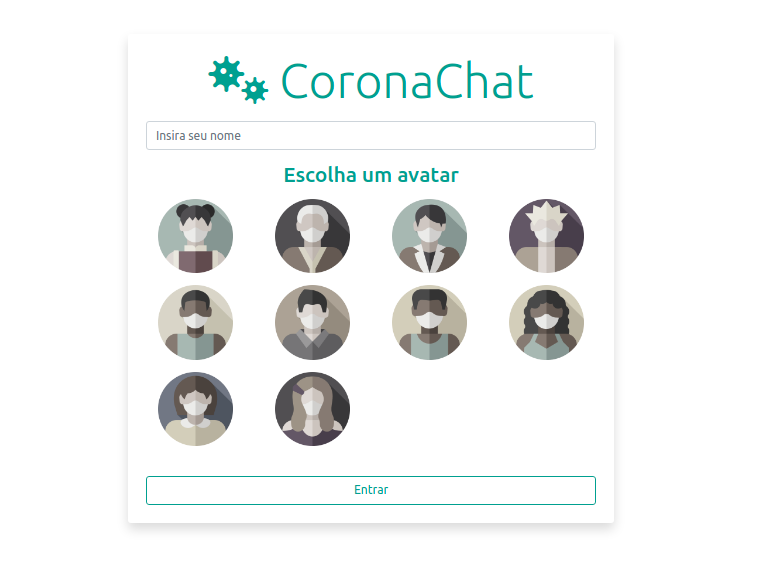
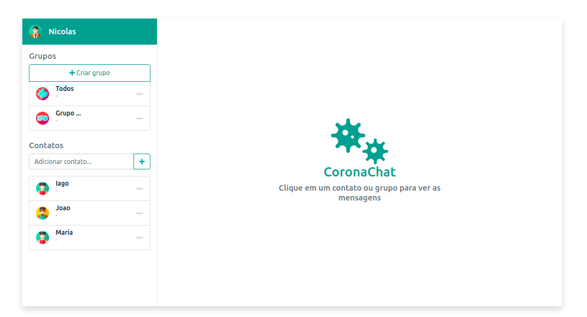
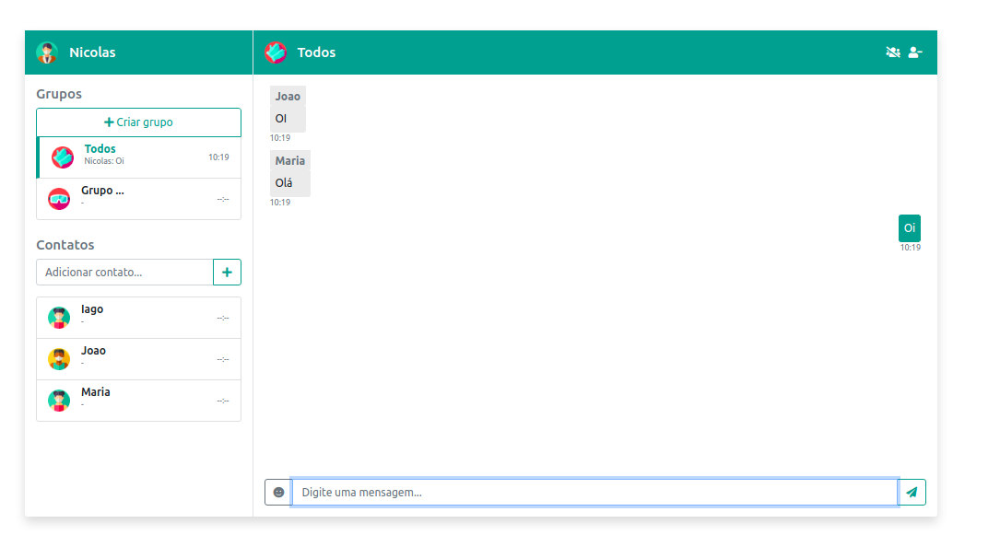
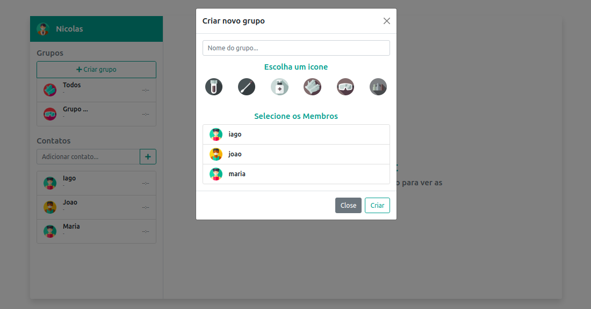

# Chat Node.js

Chat desenvolvido no período da pandemia com intuito de implementar uma comunicação cliente-servidor
em que é possível realizar comunicação privada, em grupo e com todos usuários conectados.

| | |
|-|-|
| |  |
|    |  |


## Desenvolvedores

- [Nicolas Bortoluzzi](https://github.com/Nicolasbort)
- [Iago Almeida](https://github.com/iagobalmeida)

## Tecnologias Usadas

- Node.js
- Vue.js
- Socket.io

## Como Usar

```
git clone https://github.com/Nicolasbort/Chat-nodejs
cd Chat-nodejs
```

- Abra dois terminais

### Rodando o Client

```
cd client
npm install
npm run serve
```

Abra http://localhost:8080

### Rodando o Server

```
cd server
npm install
npm run start
```
